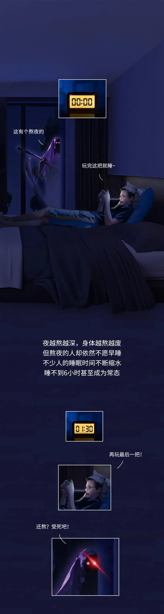
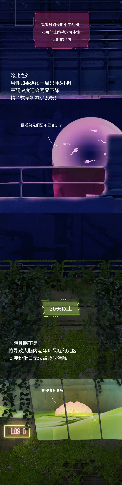

# 每天只睡6个小时，多少天会死？？？

- 修改自[知乎专栏](https://zhuanlan.zhihu.com/p/445996978)
- 演讲：[TC999](https://github.com/TC999)
- 班级：23制造本科2班

# 目录
- [现状](#现状)
- [正片开始](#正片开始)
- [结语](#结语)
- [鸣谢](#鸣谢)

# 现状

# 正片开始

# 结语
- 如果每天睡眠不足6小时，坚持30天，你整个人的状态就像“明明喝醉了却非说自己没醉”。即使注意力和反应明显变差，你也并不觉得，也并未发现。因为你已经习惯了这种生活，误把这种情况，当成了自己身心的正常状态。

- 很多人追捧号称每天只睡两小时，就能精力充沛的达芬奇睡眠法：工作四小时，睡15-20分钟。但它并没有科学依据，无法让你保持良好的身体状态，而且几乎没有人能长期坚持下来。不信的话，你可以试试，回头来留言区说说感受。

- 一些人声称自己每天只睡4个小时就足够，这可能是因为他们体内有“短睡基因”。但这种人非常稀有，连1%都不到。不过即使基因如此，他们的身体依然诚实，时间长了心脑血管疾病也会找上门来。

- 所以，记得早睡！
- 多谢大家收看！

# 鸣谢

- [文章出处(知乎专栏)](https://zhuanlan.zhihu.com/p/445996978)
- 技术支持：[GitHub](https://github.com/)、[VSCode](https://github.com/microsoft/vscode)、[篡改猴(Tampermonkey)](https://www.tampermonkey.net/)、[github-chinese](https://github.com/maboloshi/github-chinese)、[fastgithub](https://github.com/WangGithubUser/FastGitHub)